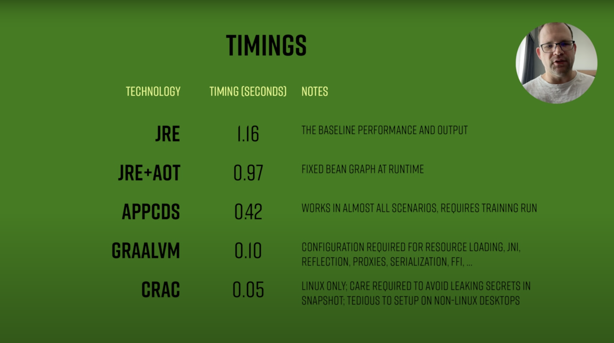

# Spring Boot 3 Workshop

This is the code behind my What's new in Spring Boot 3 Workshop. 

## Spring Boot 3.x Features

- Spring Boot 3.0 (November 24, 2022)
  - JDK 17
  - Jakarta EE
  - AoT
  - Observability
- Spring Boot 3.1 (May, 18 2023)
  - Auto-configuration for Spring Authorization Server
  - Docker Compose Module
  - Simplified configuration of Testcontainers in integration tests
- Spring Boot 3.2 (November, 23, 2023)
  - Support for Virtual Threads
  - Observability Improvements
  - Initial support for JVM Checkpoint Restore (Project CRaC)
  - Support for RestClient
  - Support for JdbcClient
- Spring Boot 3.3 (May 23, 2024)
  - CDS Support for improved startup times and reduced memory consumption
  - Observability improvements
  - Docker Compose support for Bitnami Container Images
  - Service connection support for Apache ActiveMQ Artemis and LDAP

## Agenda

- Spring Initializr
- Model
- Database Abstractions (Picking the correct one for your project)
- Rest Client
- Runtime Efficiency
- Upgrade with OpenRewrite

**Themes:** 
- Developer Experience
- Runtime Efficiency

## Spring Initializr

- Remembers your preferences
- web,postgresql,docker-compose,jdbc,spring-data-jdbc,validation,native,actuator,devtools
  - [This Project](https://start.spring.io/#!type=maven-project&language=java&platformVersion=3.3.1&packaging=jar&jvmVersion=22&groupId=dev.danvega&artifactId=sb3-kcdc&name=sb3-kcdc&description=Spring%20Boot%203%20Workshop&packageName=dev.danvega.sb3w&dependencies=web,postgresql,docker-compose,jdbc,validation,native,actuator,devtools,data-jdbc)
- Open the project in IntelliJ
  - Inspect Docker Compose
  - Run the application
    - Docker Compose
    - Tomcat 10.1 & Servlet API 6.0 (Jakarta EE 10)

## Building out the Model for our application

- Architecture
  - Package by layer
  - Package by feature
  - [Spring Modulith](https://spring.io/projects/spring-modulith)
  - Create a `Post` Package
  - Create Post class
  - Migrate to Post Record
    - Canonical Constructor
  - Validation

## Database Abstractions

- History of Database Abstractions
- Connect to a database
  - No tables (yet)
  - `schema.sql`/ `application.properties`
- Jdbc Template
- Jdbc Client
- [Spring Data](https://spring.io/projects/spring-data) 
  - Convert to Spring Data JDBC

## Rest Clients

- JsonPlaceholderService (https://jsonplaceholder.typicode.com/)
- History of Clients
  - Rest Template
  - Rest Client
  - Http Interfaces

## Runtime Efficiency
  
  - About Runtime Efficiency 
    - This idea that we are all taking different workloads to production
    - Java and Spring are giving us the tools to solve for these different problems
  - Uber Jar
  - [Ahead-of-Time Compilation (AOT)](https://docs.spring.io/spring-framework/reference/core/aot.html)
    - Native Images (3.0)
      - You need the maven-native-plugin and GraalVM JDK
      - `./mvnw -Pnative native:compile`
  - Virtual Threads (3.2)
  - Project CrAC (3.2)
  - CDS (3.3)

Check out Josh's [Spring Tips: Go Further and Faster with Spring Boot 3.3 (Updated)](https://www.youtube.com/watch?v=zeY3Wg1ieqI)

## Upgrading to Spring Boot 3.x

OpenRewrite is an automated refactoring ecosystem for source code, enabling developers to effectively eliminate technical debt within their repositories.

It consists of an auto-refactoring engine that runs prepackaged, open-source refactoring recipes for common framework migrations, security fixes, and stylistic consistency tasks – reducing your coding effort from hours or days to minutes.

- [Rewrite Project on GitHub](https://github.com/danvega/rewrite)
- [Open Rewrite Website](https://docs.openrewrite.org/)
- Recipes
  - What are they? 
  - How to Run Recipes
    - You can run them from the command line
    - You can also run them from the IDE. You used to need a plugin for this, but now it's included automatically.
- [UseStaticImports Example](https://docs.openrewrite.org/recipes/java/testing/junit5/staticimports)
- Upgrade Spring Boot incrementally 
  - 2.7.x -> 3.0 -> 3.1 -> 3.2 -> 3.3
  - Run the recipes right from within the idea. This used to be a plugin you had to add, but now it's automatically added for you

## Workshop Notes

- Push Updated Repo
  - Starting Branch
- Intro
  - I have good news and bad news... 
    - The bad news is I have about 100 slides that I can use for this talk
    - The good news is we aren't using any of them today! 
    - I have a GitHub Repo readme that we are go to go through and that you can follow along with
  - Docker
    - Make sure Docker Desktop is running
    - Delete container before workshop 
  - Browser Windows to be open
    - https://www.danvega.dev/
    - https://github.com/danvega/sb3-workshop
    - https://start.spring.io/
  - Have a native image built already in case we have issues
  - sdkman
    - `.sdkmanrc`
      - `sdk env init`
      - `sdk env`
  - Have Rewrite Project in recent projects list

